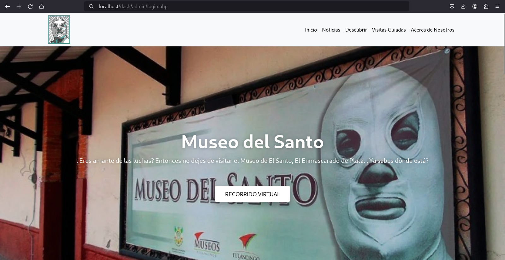
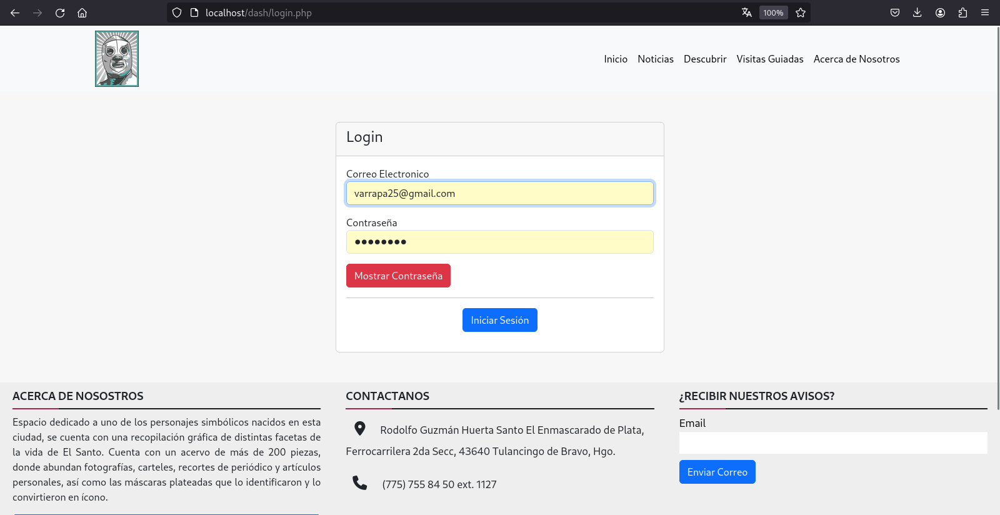
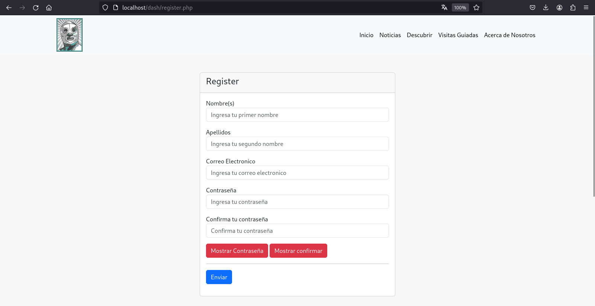
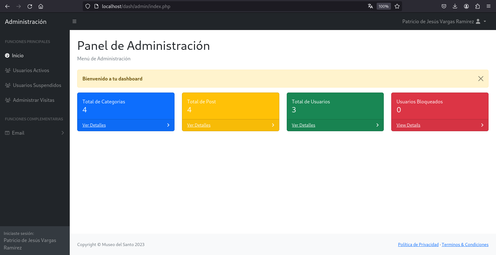

# Proyecto_Integrador_I
En este respositorio se almacena el proyecto integrador realizado en tercer cuatrimestre
siendo nuevamente retomado en el presente quinto cuatrimestre



## Colaboradores
* Desarrollador: [Janneth Santos](https://github.com/jannethsm31)
* Desarrollador: [Jose David](https://github.com/JoseDavidEsquivel)

# Instalación

* ## Descarga
Clona este repositorio en la carpeta htdocs para poder ser visualizado en el empaquetador de aplicaciones
XAMPP utilizando Apache como servidor.
```
https://github.com/PatricioVargasR/Proyecto_Integrador_I.git
```

* ## Configuración de los archivos
Una vez descargado, se recomienda renombrar la carpeta a *dash*, esto para evitar conflictos con el archivo *config.php* ubicado
en la ruta *dash/uploads/* puesto a que este archivo se encarga de colocar una URL base en ciertos elementos, si deseas modificar esto, basta con modificar la siguiente línea del archivo:
```php
<?php
    session_start();
    include('admin/config/dbconn.php');

    function base_url($slug){
        // Línea a modificar, puedes cambiar después cambiar el nombre de "dash" acorde al nombre de tu carpeta
        echo 'http://localhost/dash/'.$slug;
    }
?>

```

* ## Configuración de la base de datos
Este proyecto utiliza una base de datos para almacenar desde las publicaciones de la página así como los usuarios administrados, para hacer uso de este recurso y tener buen funcionamiento de la página.
Utilizando el archivo *admi.sql*, puedes importarlo a tu administrador de bases de datos, en este caso, *phpmyadmin*, puedes seguir los siguientes pasos:
* Crea una nueva base de datos llamada *admi*
* Importa el archivo mencionando anteriormente (admin.sql) en el apartado importar de la base de datos que acabas de crear
* Finalmente tendrías que ver lo siguiente reflejado

En caso de que hayas llamado tu base de datos de otra manera, dirigete al archivo ubicado en *admin/config/* llamado *dbconn.php*:
```php
<?php
    // Se te recomienda modificar solamente la línea de $database, en caso de que tengas alguna configuración de usuario o contraseña extra, agrégala
    $server = 'localhost';
    $username = 'root';
    $password = '';
    $database = 'admi';

    $conn = mysqli_connect("$server", "$username", "$password", "$database");

    if (!$conn) {

        header('Location: ../errors/dberror.php');
        die();
    }

?>
```
* ## Configuración de usuarios
Como se mencionó anteriormente, este proyecto consiste de dos partes principales, usuarios y administradores, en caso de querer acceder al dashboard de administrador, puedes redireccionarte a el utilizando la siguiente ruta en tu navegador *http://localhost/dash/login.php*, donde ingresarás las credenciales correspondientes, como se puede ver a continuación.



El sistema actualmente cuenta con tres grados de niveles, usuario, administrador y superadministrador, a continuación se presentan las credenciales almacenadas en la base de datos:
```sql
-- Administrador:
-- usuario: janneth@gmail.com
-- contraseña: janneth

-- Superadministrador:
-- usuario: varrapa25@gmail.com
-- contraseña: patricio
```

En caso de que desees ingresar un nuevo usuario, solo dirígete a la ruta *http://localhost/dash*



Con las configuraciones anteriormente puestas, el proyecto debería de funcionar sin problemas, en caso de surgir un incoveniente, reportarlo.

## Estructura del proyecto
```bash
.
├── 404.php
├── acerca.php
├── admin
│   ├── artwork-add.php
│   ├── artwork-edit.php
│   ├── artwork-view.php
│   ├── assets
│   │   ├── demo
│   │   │   ├── chart-area-demo.js
│   │   │   ├── chart-bar-demo.js
│   │   │   ├── chart-pie-demo.js
│   │   │   └── datatables-demo.js
│   │   └── img
│   │       └── error-404-monochrome.svg
│   ├── authentication.php
│   ├── block-edit.php
│   ├── category-add.php
│   ├── category-edit.php
│   ├── category-view.php
│   ├── code.php
│   ├── codesuperadmin.php
│   ├── config
│   │   └── dbconn.php
│   ├── css
│   │   └── styles.css
│   ├── curiosity-edit.php
│   ├── efemeride-add.php
│   ├── efemeride-edit.php
│   ├── img
│   ├── includes
│   │   ├── footer.php
│   │   ├── header.php
│   │   ├── navbar-top.php
│   │   ├── scripts.php
│   │   └── sidebar.php
│   ├── index.php
│   ├── js
│   │   ├── datatables-simple-demo.js
│   │   └── scripts.js
│   ├── message.php
│   ├── middleware
│   │   └── superadminAuth.php
│   ├── post-add.php
│   ├── post-edit.php
│   ├── post-view.php
│   ├── register-add.php
│   ├── register-edit.php
│   ├── view-block.php
│   ├── view-curiosity.php
│   ├── view-efemeride.php
│   ├── view-email.php
│   ├── view-register.php
│   └── view-visitas.php
├── admi.sql
├── allcode.php
├── assets
│   ├── css
│   │   ├── bootstrap5.min.css
│   │   └── custom.css
│   ├── img
│   │   ├── 65054.jpg
│   │   └── logo.jpg
│   └── js
│       ├── bootstrap5.min.js
│       ├── jquery.min.js
│       └── scripts.js
├── AVISO DE PRIVACIDAD.pdf
├── category.php
├── descubrir.php
├── entretenimiento.php
├── errors
│   └── dberror.php
├── hoteles.php
├── includes
│   ├── config.php
│   ├── footer.php
│   ├── header.php
│   └── navbar.php
├── index.php
├── logincode.php
├── login.php
├── message.php
├── noticias.php
├── posts.php
├── procesar.php
├── prueba.html
├── README.md
├── recorrido.html
├── registercode.php
├── register.php
├── restaurantes.php
├── script.js
├── sobre.php
├── style.css
├── test.php
├── uploads
│   └── posts
│       ├── Cineteca.jpg
│       ├── Datos.jpg
│       ├── Ejemplos2.jpg
│       ├── Ejemplos.jpg
│       ├── Entretenimiento.jpg
│       ├── exhibicion13.jpeg
│       ├── exhibicion1.jpeg
│       ├── exhibicion2.jpeg
│       ├── exhibicion_video.jpg
│       ├── Ferrocarril.jpg
│       ├── Hoteles.jpg
│       ├── Noticia.jpg
│       ├── Restaurante.jpg
│       └── Tulancingo.jpg
├── visitas.html
└── visitas.php

19 directories, 95 files
```
# Capturas de pantalla:
* ## Dashboard de administrador


* ## Dashboard de super administrador

